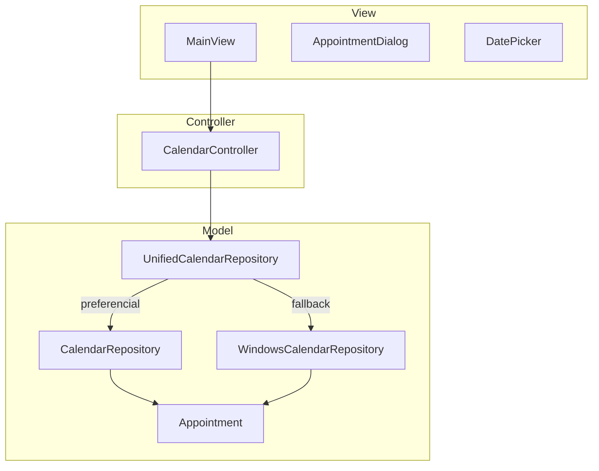

# Agenda

Aplicação desktop em Python para gerenciar compromissos no **Calendário do Windows**, com interface moderna e arquitetura **MVC**. O acesso aos dados é feito por uma camada de repositórios que escolhe automaticamente o melhor backend disponível (Outlook COM ou API WinRT).

[](https://www.python.org/)
[](https://www.microsoft.com/windows)
[](LICENSE)

## Funcionalidades

- Listar compromissos por período (7, 30, 90 ou 365 dias)
- Criar, editar e excluir eventos
- Seletor de data com calendário (`dd/mm/aaaa`)
- Interface com [CustomTkinter](https://github.com/TomSchimansky/CustomTkinter) (tema escuro)
- Conexão automática ao backend de calendário mais adequado

## Requisitos

| Item | Detalhe |
|------|---------|
| Sistema | Windows 10 ou 11 |
| Python | 3.11 ou superior |
| Conta | Microsoft configurada no Outlook **ou** no app Calendário do Windows |
| Dependências | Ver [`requirements.txt`](requirements.txt) |

## Instalação

```powershell
git clone https://github.com/CarlosBaldoino2005/python-calendario-windows.git
cd python-calendario-windows
python -m venv .venv
.\.venv\Scripts\Activate.ps1
pip install -r requirements.txt
```

## Uso

```powershell
python main.py
```

Na primeira execução, o Windows ou o Outlook podem solicitar permissão para acessar o calendário. A barra de status indica qual backend foi selecionado.

## Arquitetura



| Camada | Responsabilidade |
|--------|------------------|
| **View** | Interface gráfica, formulários e listagem |
| **Controller** | Orquestra ações do usuário e chama o repositório |
| **Model** | Entidade `Appointment` e acesso ao calendário do Windows |

O ponto de entrada [`main.py`](main.py) instancia `UnifiedCalendarRepository`, `MainView` e `CalendarController`, e inicia o loop da interface.

## Repositórios de calendário

A aplicação isola o acesso ao calendário em três implementações. Todas expõem a mesma interface operacional: `connect`, `list_appointments`, `create`, `update`, `delete` e `get_by_id`.

### Visão geral

| Repositório | Módulo | Tecnologia | Quando é usado |
|-------------|--------|------------|----------------|
| **UnifiedCalendarRepository** | `unified_calendar_repository.py` | Fachada | Sempre — é o repositório injetado em `main.py` |
| **CalendarRepository** | `calendar_repository.py` | Outlook COM (`pywin32`) | 1ª tentativa de conexão |
| **WindowsCalendarRepository** | `windows_calendar_repository.py` | WinRT (`winrt`) | Fallback se o Outlook não estiver disponível |

### `UnifiedCalendarRepository` (fachada)

Coordena a escolha do backend e expõe uma API única ao controlador.

- **Ordem de conexão:** Outlook COM → WinRT
- **Propriedade `backend_name`:** texto exibido na interface (`Outlook / Conta Microsoft` ou `Calendário local (WinRT)`)
- **Erros:** agrega as falhas de ambos os backends em um único `CalendarConnectionError` se nenhum conectar

O controlador não precisa conhecer detalhes de COM ou WinRT; toda delegação ocorre nesta classe.

### `CalendarRepository` (Outlook COM)

Backend **preferencial**. Utiliza `win32com.client` para falar com o Microsoft Outlook via MAPI.

| Aspecto | Comportamento |
|---------|---------------|
| Conexão | `Dispatch("Outlook.Application")` e pasta padrão de calendário (`OL_FOLDER_CALENDAR`) |
| Identificador | `EntryID` do Outlook (string única por item) |
| Listagem | Varre itens ordenados por `[Start]`, com suporte a recorrências |
| Eventos de dia inteiro | `AllDayEvent` com fim na meia-noite do dia seguinte |
| Dependência | `pywin32` instalado e Outlook ou perfil MAPI configurado |

Ideal quando o usuário já sincroniza contas Microsoft pelo Outlook; costuma refletir imediatamente no app Calendário do Windows.

### `WindowsCalendarRepository` (WinRT)

Backend **alternativo**. Acessa o app **Calendário** do Windows pela API `Windows.ApplicationModel.Appointments`, sem exigir o Outlook.

| Aspecto | Comportamento |
|---------|---------------|
| Conexão | `AppointmentManager.request_store_async` com permissão `ALL_CALENDARS_READ_WRITE` |
| Identificador | Composto: `{calendar_local_id}\|{appointment_local_id}` |
| Calendário padrão | Primeiro calendário que permite `can_create_or_update_appointments` |
| Assíncrono | Operações internas em `async/await`; métodos públicos usam `asyncio.run()` |
| Dependência | Pacotes `winrt-*` listados em `requirements.txt` |

Útil em máquinas sem Outlook instalado, desde que o app Calendário esteja configurado.

### Modelo `Appointment`

Classe de domínio independente do backend ([`appointment.py`](app/models/appointment.py)):

- `entry_id`, `subject`, `start`, `end`, `location`, `body`, `all_day`
- Propriedades de exibição: `display_date`, `display_time_range`, `duration_minutes`

Cada repositório converte entre objetos nativos (COM ou WinRT) e `Appointment`.

## Estrutura do projeto

```
Agenda/
├── main.py                      # Entrada: monta MVC e inicia a aplicação
├── agenda.spec                  # Configuração PyInstaller → Agenda.exe
├── requirements.txt
├── build.bat                    # Script para gerar o executável
├── scripts/
│   ├── debug_calendars.py       # Diagnóstico WinRT (calendários e permissões)
│   └── test_list.py             # Teste rápido de listagem
└── app/
    ├── models/
    │   ├── appointment.py
    │   ├── calendar_repository.py           # Outlook COM
    │   ├── windows_calendar_repository.py   # WinRT
    │   └── unified_calendar_repository.py   # Fachada
    ├── views/
    │   ├── main_view.py
    │   ├── appointment_dialog.py
    │   └── date_picker.py
    └── controllers/
        └── calendar_controller.py
```

## Scripts de diagnóstico

```powershell
# Lista calendários WinRT e testa permissões de escrita
python scripts/debug_calendars.py

# Teste de listagem (conforme implementado no script)
python scripts/test_list.py
```

## Tecnologias

| Biblioteca | Uso |
|------------|-----|
| [CustomTkinter](https://github.com/TomSchimansky/CustomTkinter) | Interface gráfica |
| [pywin32](https://github.com/mhammond/pywin32) | Integração Outlook COM |
| [tkcalendar](https://github.com/j4321/tkcalendar) | Seletor de datas |
| [winrt](https://pypi.org/project/winrt/) | API nativa do Calendário Windows |

## Gerar executável

```powershell
pip install pyinstaller
python -m PyInstaller agenda.spec --noconfirm
```

Ou execute `build.bat`. O binário será gerado em **`dist/Agenda.exe`**.

## Desenvolvimento

```powershell
# Ambiente virtual recomendado
python -m venv .venv
.\.venv\Scripts\Activate.ps1
pip install -r requirements.txt
python main.py
```

Convenção de commits sugerida ([Conventional Commits](https://www.conventionalcommits.org/)):

- `feat:` nova funcionalidade
- `fix:` correção de bug
- `docs:` documentação
- `refactor:` refatoração sem mudança de comportamento
- `chore:` build, dependências, configuração

## Licença

Este projeto está licenciado sob a [MIT License](LICENSE).
